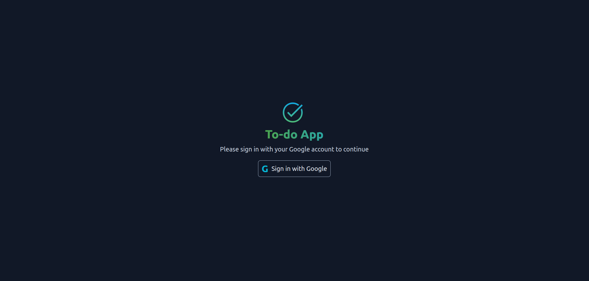
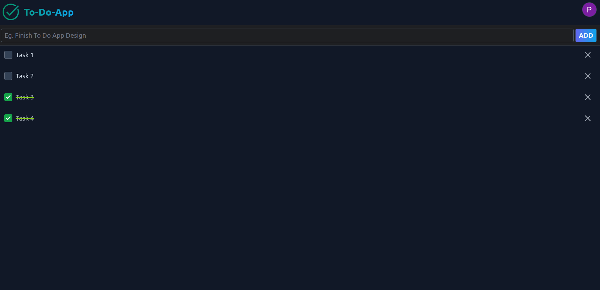

# Todo App

## Version
0.1.0

## Introduction

📝 Welcome to the Todo App! This platform, powered by Angular, Spring Boot,  PostgreSQL,Tailewind and firebase, provides a user-friendly task management experience. Log in with your email, and seamlessly perform CRUD operations on your tasks. Stay organized and boost productivity with our intuitive todo application. Let's get things done! ✅💻

### Features

- **Login:** Securely log in with your email.
- **Create:** Add new tasks to your todo list.
- **Read:** View your existing tasks with ease.
- **Update:** Modify task details or completion status.
- **Delete:** Remove tasks from your todo list.

### Login

### Home

## Technologies Used

### Frontend

- **Framework:** Angular
- **HTTP Client:** Angular HTTPClient
- **Animations:** Angular Animations
- **Notification:** ngx-toastr

### Backend

- **Framework:** Spring Boot (Spring Web MVC)
- **Database:** PostgreSQL
- **Validation:** Hibernate Validator
- **Connection Pooling:** HikariCP

## License

Copyright &copy; 2024 Pravinda Bandara. All Rights Reserved  
This project is licensed under the [MIT License](LICENSE.txt).
